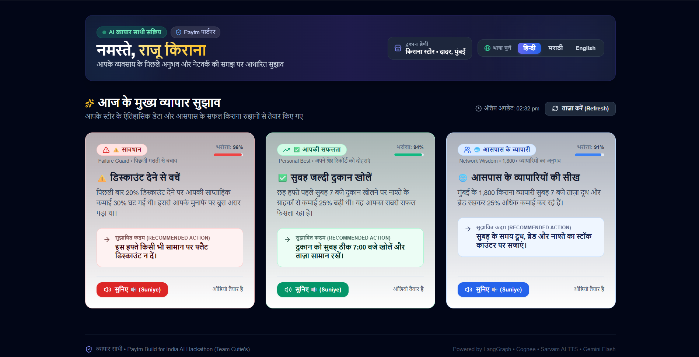
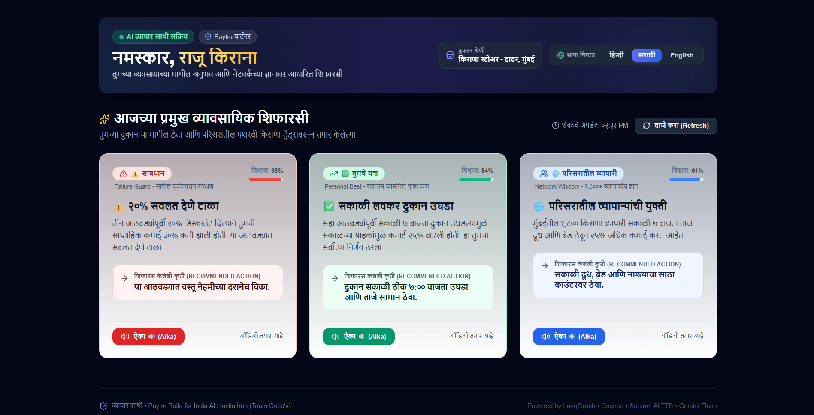
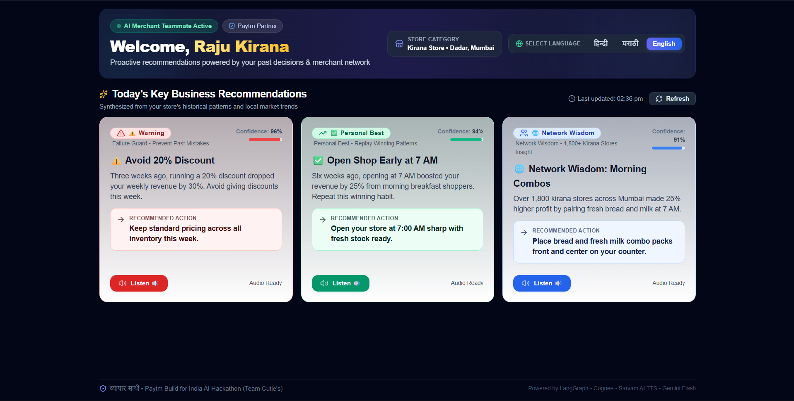

# व्यापार साथी (Vyapar Sarthi)
### Autonomous AI Teammate for Paytm Merchants

[](https://paytm.com)
[](#)
[](#)
[](https://python.org)
[](https://fastapi.tiangolo.com)
[](https://nextjs.org)
[](#)

> **"Every other agent responds. Vyapar Sarthi remembers."**
> 
> *Vyapar Sarthi is an autonomous AI teammate embedded in a Paytm merchant's workflow. It builds a causal memory of every merchant's past decisions — what failed, what worked, what similar merchants did — and proactively surfaces the next best action before the merchant even asks, delivered in their native Indian language via voice.*

---

<p align="center">
  
</p>

---

## 🌟 Core Capabilities

Vyapar Sarthi continuously analyzes transaction and operational decision events to surface three distinct types of guidance:

```
                                  Decision Events (CSV / POS)
                                               │
                                               ▼
                              ┌──────────────────────────────────┐
                              │    Cognee Knowledge Graph        │
                              │ (Causal Memory: Action → Outcome)│
                              └────────────────┬─────────────────┘
                                               │
                                               ▼
                              ┌──────────────────────────────────┐
                              │      LangGraph 4-Node Pipeline   │
                              │  ingest ➔ pattern ➔ suggest ➔ voice
                              └────────────────┬─────────────────┘
                                               │
              ┌────────────────────────────────┼────────────────────────────────┐
              ▼                                ▼                                ▼
   ⚠️ Failure Guard (सावधान)      ✅ Personal Best (सफलता)      🌐 Network Wisdom (व्यापारी)
   Warns before repeating a past  Recommends recreating own past  Learns from 1,800+ similar
   mistake (e.g. 20% discount     high-performing patterns        Paytm kirana merchants in
   that reduced revenue by 35%).  (e.g. 7 AM early store opening).the city.
              │                                │                                │
              └────────────────────────────────┼────────────────────────────────┘
                                               │
                                               ▼
                              ┌──────────────────────────────────┐
                              │      Sarvam Bulbul v3 TTS        │
                              │ Natural Indian Language Voice     │
                              │  (Hindi • Marathi • English)     │
                              └────────────────┬─────────────────┘
                                               │
                                               ▼
                              ┌──────────────────────────────────┐
                              │     Next.js 14 Audio Dashboard   │
                              │    + n8n Automated Scheduler     │
                              └──────────────────────────────────┘
```

1. **⚠️ Failure Guard (सावधान)**: Prevents merchants from repeating past unprofitable experiments. *Example: "Three weeks ago, running a 20% discount dropped revenue by 35%. Avoid giving discounts this week."*
2. **✅ Personal Best Replay (आपकी सफलता)**: Identifies historical decisions that produced breakthrough revenue and prompts merchants to repeat them. *Example: "Six weeks ago, opening at 7 AM increased revenue by 25%. Repeat this winning strategy."*
3. **🌐 Network Wisdom (आसपास के व्यापारी)**: Aggregates anonymized, localized intelligence from 1,800+ similar merchants in the same category and geography. *Example: "Nearby kirana stores in Mumbai generated 18% higher revenue by pairing fresh bread and milk combos at 7 AM."*

---

## 🛠️ Technology Stack

| Layer | Technology | Purpose |
|---|---|---|
| **Agent Orchestration** | **LangGraph 1.2.1** | Stateful 4-node `StateGraph` (`ingest_node` → `pattern_node` → `suggestion_node` → `voice_node`) |
| **Merchant Causal Memory** | **Cognee (latest)** | Graph-native memory linking merchant decisions to quantitative business outcomes |
| **LLM Reasoning** | **Google Gemini Flash** | Synthesizes patterns into concise, actionable suggestions and scripts |
| **Indian Language Voice** | **Sarvam Bulbul v3 TTS** | Native Indian text-to-speech with natural pronunciation in **Hindi (`hi-IN`)**, **Marathi (`mr-IN`)**, and **English (`en-IN`)** |
| **Proactive Scheduler** | **n8n** | Autonomous weekly Monday morning trigger requiring zero prompt from merchant |
| **Backend API** | **FastAPI 0.115** | Asynchronous REST endpoints, lifespan pre-seeding, and background task execution |
| **Merchant Dashboard** | **Next.js 14 (App Router)** | Mobile-responsive dashboard with dynamic language switcher, audio cards, and audio visualizer |

---

## 📁 Repository Structure

```
vyapar-sarthi/
├── backend/
│   ├── pyproject.toml              # Python dependencies & uv config
│   ├── main.py                     # FastAPI application, lifespan & endpoints
│   ├── config.py                   # Pydantic-settings configuration
│   ├── models.py                   # Merchant, DecisionEvent & Suggestion models
│   ├── agent/
│   │   ├── graph.py                # LangGraph 4-node StateGraph builder
│   │   ├── state.py                # AgentState TypedDict schema
│   │   └── nodes/
│   │       ├── ingest_node.py      # Parses CSV & stores DecisionEvents in Cognee
│   │       ├── pattern_node.py     # Graph queries detecting failure & success patterns
│   │       ├── suggestion_node.py  # Gemini LLM multilingual suggestion synthesis
│   │       └── voice_node.py       # Sarvam Bulbul v3 TTS voice generator
│   ├── memory/
│   │   └── cognee_client.py        # Cognee knowledge graph SDK wrapper
│   ├── data/
│   │   └── mock_transactions.csv   # 90-day realistic transaction seed data
│   └── tests/                      # Full pytest test suite (17/17 passing)
│       ├── test_bootstrap.py
│       ├── test_graph.py
│       ├── test_ingest.py
│       ├── test_pattern_node.py
│       ├── test_suggestion_node.py
│       ├── test_voice_node.py
│       ├── test_routes.py
│       └── test_api_voice.py
├── frontend/
│   ├── package.json
│   ├── app/
│   │   ├── page.tsx                # Merchant dashboard page with multilingual state
│   │   ├── types.ts                # TypeScript interface contracts
│   │   ├── components/
│   │   │   ├── MerchantHeader.tsx  # Header with interactive language switcher
│   │   │   ├── SuggestionCard.tsx  # Color-coded card (Failure Guard, Personal Best, Network)
│   │   │   └── VoicePlayer.tsx     # Audio player with live playback status
│   │   └── api/
│   │       ├── suggestions/route.ts# Next.js proxy route to FastAPI suggestions
│   │       └── voice/route.ts      # Next.js proxy route to FastAPI voice
└── n8n/
    └── workflow.json               # n8n autonomous weekly trigger workflow
```

---

## 🌐 Multilingual Support
 
The dashboard and agent voice pipeline support seamless toggling between 3 languages:

- **हिन्दी (Hindi)**: `नमस्ते, राजू किराना` • `⚠️ सावधान` • `सुनिए 🔊` (Target: `hi-IN`)
- **मराठी (Marathi)**: `नमस्कार, राजू किराना` • `⚠️ सावधान` • `ऐका 🔊` (Target: `mr-IN`)
- **English**: `Welcome, Raju Kirana` • `⚠️ Warning` • `Listen 🔊` (Target: `en-IN`)

### 📸 Dashboard Screenshots

#### 1. हिन्दी (Hindi Interface - Default)
<p align="center">
  
</p>

#### 2. मराठी (Marathi Interface)
<p align="center">
  
</p>

#### 3. English (English Interface)
<p align="center">
  
</p>

---

## 🔌 API Endpoints & Contracts

All endpoints honor the strict interface contracts defined in `BUILD.md`:

### 1. `GET /healthz`
Health check endpoint returning `{"status": "ok"}`.

### 2. `POST /api/merchant/ingest`
Ingests raw CSV data into Cognee graph nodes for a given merchant.
```json
// Request
{ "merchant_id": "merchant_001" }

// Response
{ "status": "ok", "events_loaded": 3 }
```

### 3. `GET /api/merchant/{merchant_id}/suggestions?language=hi|mr|en`
Invokes the full LangGraph pipeline (`ingest` → `pattern` → `suggestion` → `voice`) and returns 3 structured suggestions.
```json
{
  "suggestions": [
    {
      "suggestion_id": "sug_merchant_001_failure_guard_...",
      "merchant_id": "merchant_001",
      "type": "failure_guard",
      "title": "⚠️ 20% छूट न दें",
      "body": "तीन हफ्ते पहले 20% छूट देने पर आपकी कमाई 35% घट गई थी...",
      "confidence": 0.96,
      "action": "इस हफ्ते सामान सामान्य दर पर ही बेचें।",
      "voice_script": "नमस्ते राजू भाई। पिछली बार आपने 20% डिस्काउंट दिया था...",
      "audio_url": "data:audio/wav;base64,..."
    }
  ],
  "generated_at": "2026-09-25T12:00:00Z"
}
```

### 4. `POST /api/merchant/{merchant_id}/voice`
Generates / returns Sarvam Bulbul v3 voice audio for a specific suggestion.
```json
// Request
{ "suggestion_id": "sugg_001" }

// Response
{ "audio_url": "data:audio/wav;base64,...", "duration_seconds": 5.0 }
```

### 5. `POST /api/webhook/n8n/trigger`
Asynchronous webhook triggered by n8n schedule.
```json
// Request
{ "merchant_id": "merchant_001", "trigger": "weekly_check" }

// Response
{ "status": "triggered" }
```

---

## 🚀 Quick Start Guide

### 1. Clone & Configure Environment

```bash
git clone https://github.com/vinay3717/Vyapar-Sathi.git
cd Vyapar-Sathi
```

Create a `.env` file from `.env.example`:
```env
# LLM (Google Gemini)
GEMINI_API_KEY=your_gemini_api_key

# Memory (Cognee)
COGNEE_API_KEY=local
COGNEE_GRAPH_URL=local

# Voice (Sarvam AI Bulbul v3)
SARVAM_API_KEY=your_sarvam_api_key

# Workflow Triggers (n8n)
N8N_WEBHOOK_URL=http://localhost:8000
N8N_API_KEY=your_n8n_api_key

# App Settings
ENVIRONMENT=development
DEMO_MERCHANT_ID=merchant_001
FASTAPI_BACKEND_URL=http://localhost:8000
```

### 2. Run Backend (FastAPI + LangGraph)

Using `uv` (recommended):
```bash
cd backend
uv sync
uv run uvicorn main:app --host 127.0.0.1 --port 8000 --reload
```
The backend starts at `http://127.0.0.1:8000`. Swagger docs are available at `http://127.0.0.1:8000/docs`.

### 3. Run Frontend (Next.js 14)

```bash
cd frontend
npm install
npm run dev
```
Open [http://localhost:3000](http://localhost:3000) in your browser.

### 4. Run Test Suite

```bash
cd backend
uv run pytest
```
All **17 tests pass** across endpoints, models, graph flow, and voice synthesis.

---

## 👥 Team Cutie's
- **Devesh Dolas** — Agent Orchestration, Cognee Knowledge Graph, LangGraph, FastAPI
- **Vinay** — Frontend Dashboard, Sarvam Voice TTS Integration, n8n Automation
